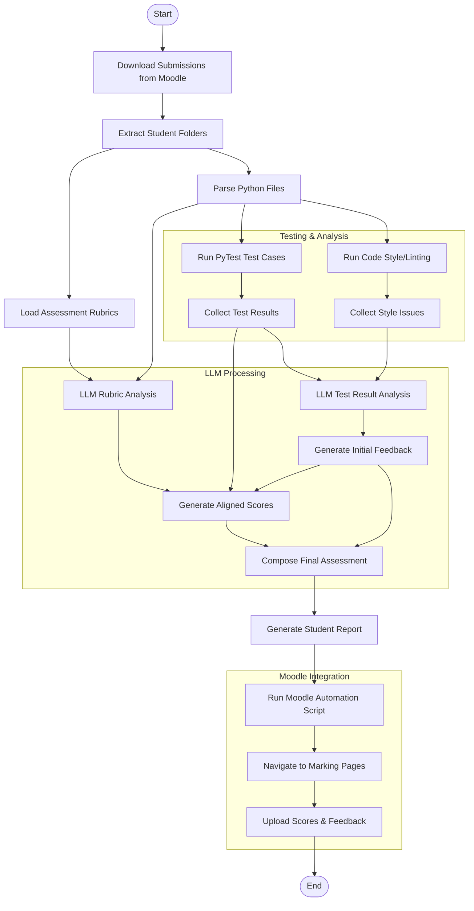
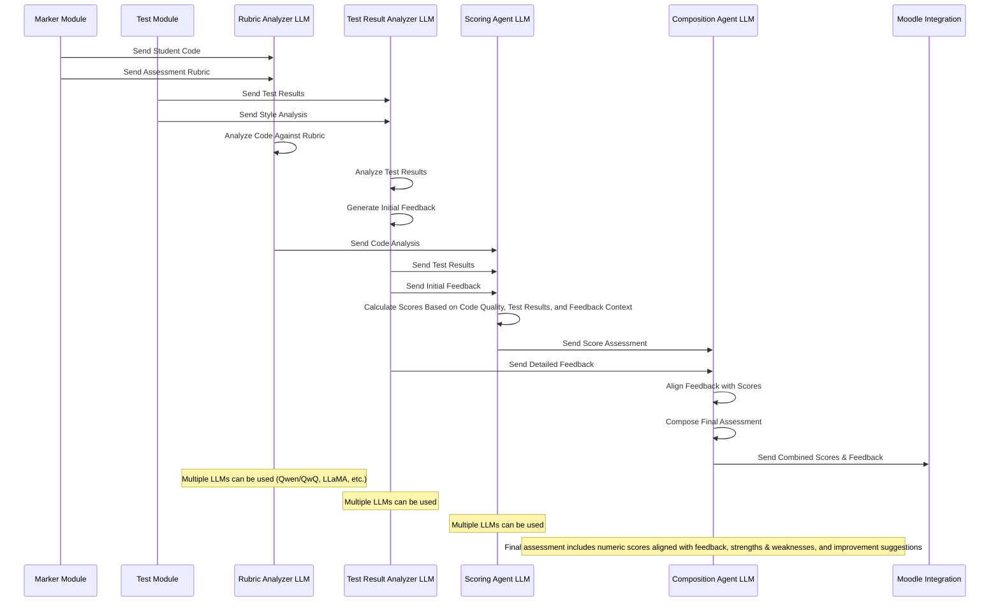
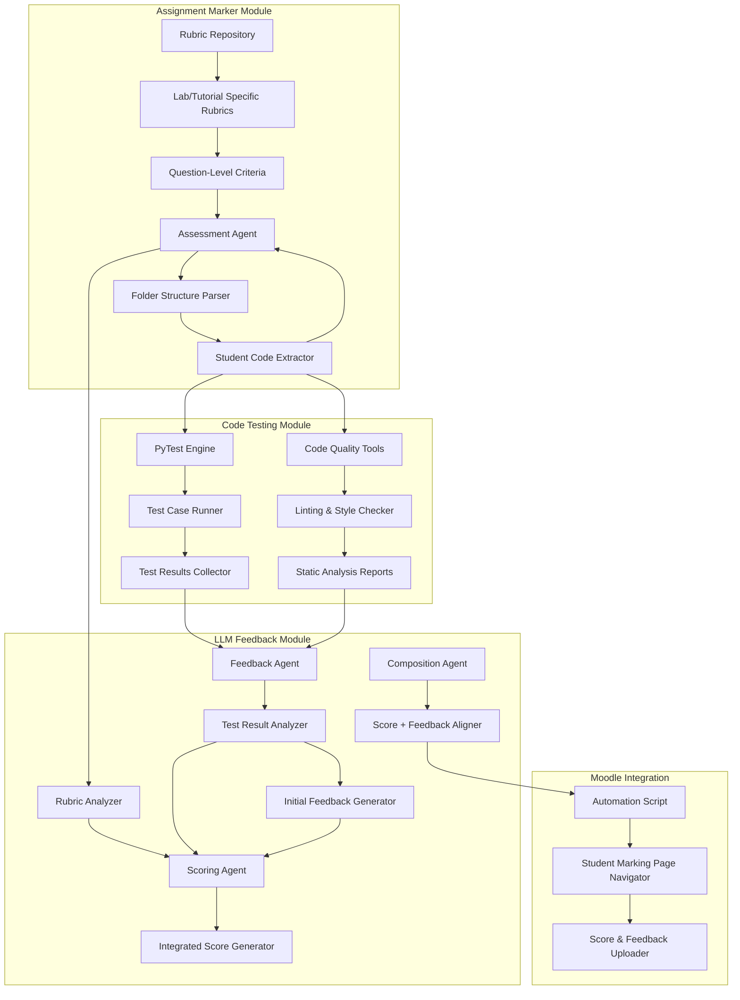

# Marking Assistant

> An automated system for assessing student code submissions with comprehensive feedback powered by LLMs

## Project Overview

This project aims to create an intelligent system that automates the assessment of student code submissions for programming labs and tutorials. By combining automated testing, code quality analysis, and LLM-based feedback, the system provides consistent, detailed feedback to help students improve their coding and mathematical abilities.

## System Design

The system consists of three primary modules and a Moodle integration component:

### 1. Assignment Marker Module

This module handles the intake and organization of student submissions:

- Moodle Assignment Loader: Downloads and organizes submissions from Moodle
- Folder Structure Parser: Processes the folder structure containing student submissions
- Student Code Extractor: Extracts Python files from student submissions
- Rubric Repository: Stores assessment rubrics for different labs/tutorials and questions

### 2. Code Testing Module

This module evaluates the correctness and quality of student code:

- PyTest Engine: Runs test cases against student code submissions
- Test Results Collector: Gathers the results of test runs
- Code Quality Tools: Performs linting and style checking (e.g., flake8, pylint, black)
- Static Analysis Reports: Generates reports on code quality issues

### 3. LLM Feedback Module

This module leverages locally deployed LLMs to generate intelligent feedback:

- Local LLM Deployment: Integration with Ollama and other models (Qwen/QwQ)
- Rubric Analyzer: Analyzes code against assessment rubrics
- Test Result Analyzer: Analyzes test results to understand code correctness
- Initial Feedback Generator: Creates detailed feedback based on test results
- Integrated Score Generator: Calculates scores based on code quality, test results, and feedback context
- Score + Feedback Aligner: Ensures consistency between numerical scores and narrative feedback

### 4. Moodle Integration

This component automates the delivery of feedback:

- Automation Script: Scripts that interface with Moodle
- Student Marking Page Navigator: Navigates to individual student marking pages
- Score & Feedback Uploader: Uploads the final assessment to Moodle

## Architecture Diagrams


### Process Flow



### System Architecture




### LLM Agent Interaction



## Requirements

### Functional Requirements

1. **Submission Processing**
   - Parse folder structures from Moodle
   - Extract Python files from student submissions
   - Load and apply appropriate rubrics based on lab/tutorial

2. **Code Assessment**
   - Run automated test cases against student code
   - Perform code style and quality analysis
   - Generate test result reports

3. **Intelligent Feedback**
   - Analyze code against rubrics using LLMs
   - Generate detailed feedback based on test results
   - Produce scores that align with both code quality and correctness
   - Create comprehensive assessment reports

4. **Moodle Integration**
   - Navigate through Moodle's interface
   - Upload scores and feedback to appropriate locations
   - Maintain session state during batch processing

### Technical Requirements

1. **Python-Based Architecture**
   - Core system written in Python
   - Support for running and analyzing Python student submissions

2. **LLM Integration**
   - Local deployment using Ollama
   - Support for multiple models (Qwen/QwQ-32B, LLaMA3.1, etc.)
   - Structured prompt templates for different analysis tasks

3. **Testing Framework**
   - PyTest-based test case execution
   - Structured test result collection
   - Support for custom test case definitions per assignment

4. **Web Automation**
   - Browser automation for Moodle interaction
   - Session management and authentication

## Usage Guide

### Running the Marking Pipeline

The marking pipeline can be run using the following command:

```bash
python marking_pipeline.py --group-name <group_name> [options]
```

#### Required Arguments:
- `--group-name`: Name of the group to process (e.g., Lab1, Ass2)
  - Must start with either "Lab" or "Ass" followed by a number

#### Optional Arguments:
- `--submissions-dir`: Path to submissions directory (default: 'submissions')
- `--model`: Name of the LLM model to use for feedback generation (default: 'openai-gpt-4o')
- `--feedback-format`: Format of the generated feedback (choices: html, markdown, text; default: markdown)
- `--log-level`: Set the logging level (choices: DEBUG, INFO, WARNING, ERROR, CRITICAL; default: INFO)
- `--log-file`: Path to log file (default: marking_pipeline.log)
- `--skip-feedback`: Skip feedback generation and only run tests
- `--skip-tests`: Skip test running and only generate feedback
- `--rubric-file`: Path to the rubric YAML file (default: 'rubric/marking_rubric.yaml')

#### Example Usage:

1. Basic usage for a lab assignment:
```bash
python marking_pipeline.py --group-name Lab1
```

2. Process an assignment with custom directories:
```bash
python marking_pipeline.py --group-name Ass2 --submissions-dir "path/to/submissions" --rubric-file "path/to/rubric.yaml"
```

3. Skip feedback generation and only run tests:
```bash
python marking_pipeline.py --group-name Lab3 --skip-feedback
```

4. Use a different LLM model and feedback format:
```bash
python marking_pipeline.py --group-name Ass1 --model llama --feedback-format markdown
```

#### Directory Structure:
The pipeline expects the following directory structure:
```
.
├── submissions/          # Student submissions
├── rubric/              # Assessment rubrics
│   ├── test_cases/      # Test cases for each group
│   └── test_results/    # Test results for each group
├── feedback/            # Generated feedback
└── marking_pipeline.log # Log file
```

#### Output:
- Test results are stored in `rubric/test_results/<group_name>/`
- Feedback is generated in `feedback/<group_name>/`
- Detailed logs are written to `marking_pipeline.log`

## Planned Development Phases

1. **Phase 1**: Core modules development
   - Assignment marker module implementation
   - Test execution framework
   - Basic LLM integration

2. **Phase 2**: LLM feedback enhancement
   - Multi-agent LLM architecture
   - Scoring alignment with feedback
   - Feedback quality improvements

3. **Phase 3**: Moodle integration
   - Browser automation development
   - Score and feedback uploading
   - End-to-end testing

## License

[TBD]
