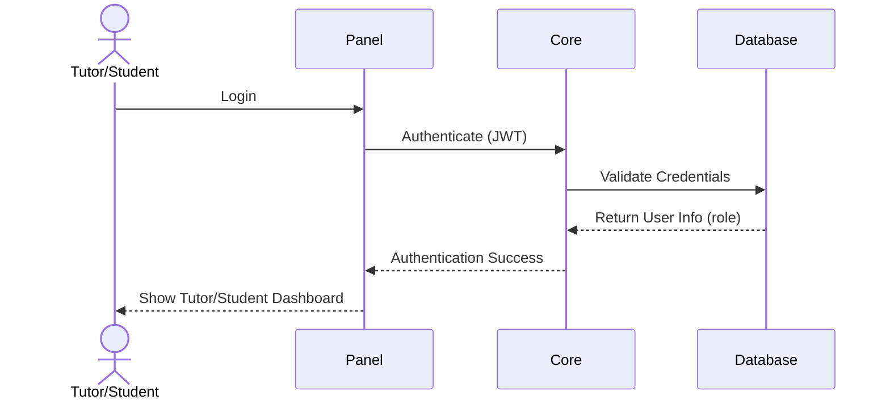
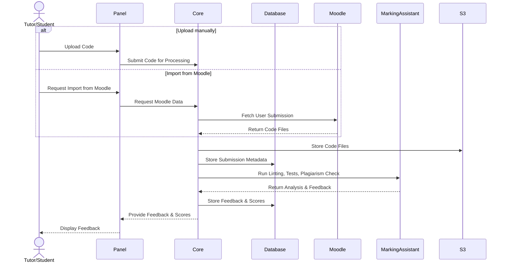
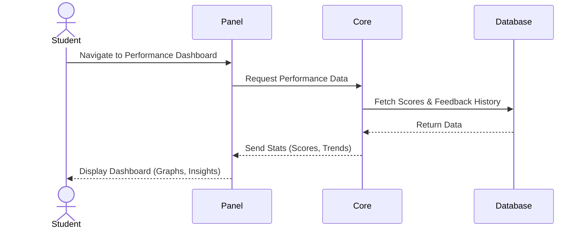
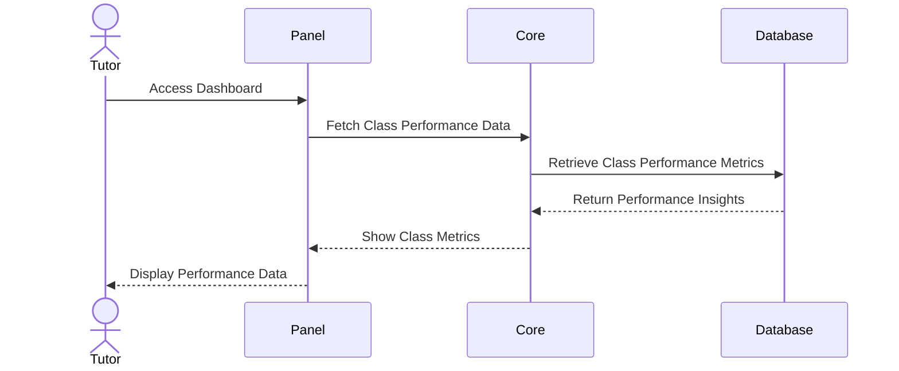
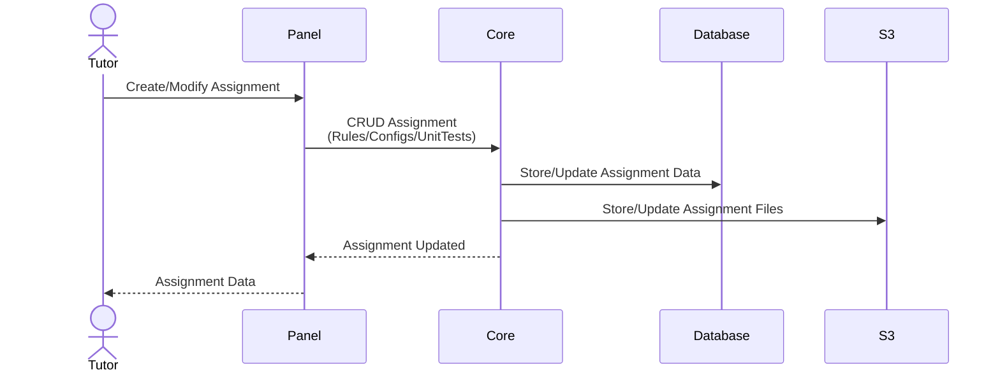

# Core Module

## Scenarios
### 1. Login

### 2. User submits code for assessment 

### 3. Student views performance dashboard

### 4. Tutor monitors classes performance

### 5. Tutor defines/modify assignment
